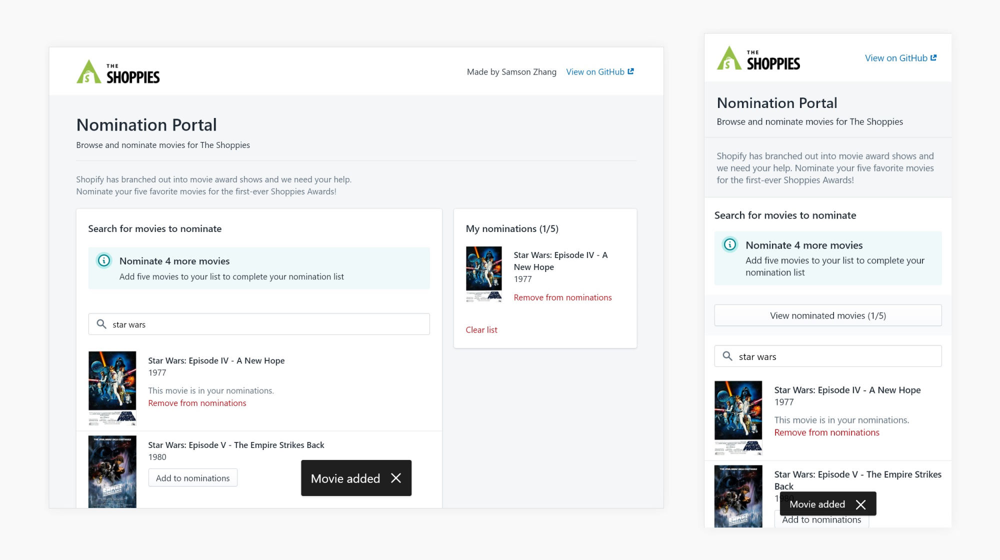
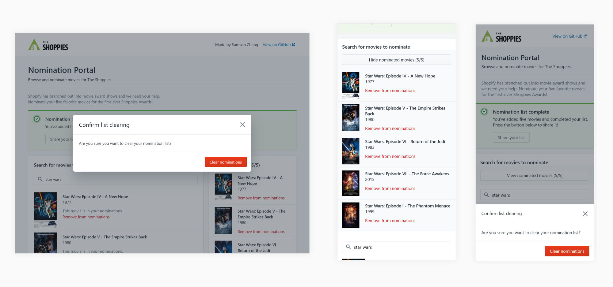
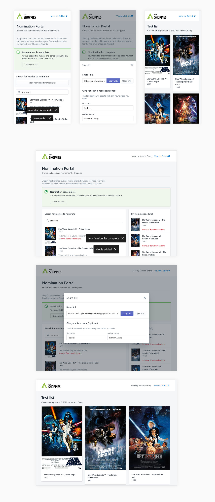

# The Shoppies Nomination Portal
Made by Samson Zhang as part of application to winter 2021 Shopify web developer and UX developer internships. Original challenge instructions [here](https://docs.google.com/document/d/1AZO0BZwn1Aogj4f3PDNe1mhq8pKsXZxtrG--EIbP_-w/preview?pru=AAABdI4KLHc*1OQJp7_pyxcqdHOIoJzf_g#heading=h.31w9woubunro)

## Overview
**UX**

The basic flow, as specified in the instructions, is as follows:

1. The user types the title of the movie they wish to nominate into the search field. The results live-update as they type or change their query.
2. The user finds the movie they were looking for and press the "Nominate" button to nominate it. A toast confirms the success of their action, and the movie is added to the "My nominations" list. In the search results, the "Nominate" button is replaced by a less prominent removal button.

At any point in time, the user may also wish to remove a movie from their nomination list. On devices with larger viewports, the "My nominations" list is always visible to the side, with an easy-to-access remove button on each movie. On mobile devices, a "view nominated movies" button above the search bar allows the user to expand the same nominations list, where they can review and remove nominations.

At the bottom of the list is a button to clear the nomination list, which clears both client-side states and `localStorage` persistent data. Clicking the button triggers a confirmation modal, as recommended by the Polaris design system for destructive actions.

Finally, once the user selects five movies for their nomination list, they are notified via toast and a success banner shows up at the top of the page. On mobile, selecting a fifth movie makes the application scroll up to the top.

The success banner prompts the user to share their list. Clicking the share button opens a sharing modal, in which the user is presented with a link that they can either copy or open in a new tab. They can also give the list a name and provide their own name, information that will be displayed in the shared link.

The shared links simply display the five nominated movies, the date of the list's creation, and any additional information shared by the user.

**Technical**

The nomination portal is built on **Next.js**, using TypeScript throughout. The OMDb API is called for querying search results and movie info on shared links.

**Styling**

Styling follows Shopify's **Polaris design system**, which I referenced for experience values and specific design patterns.
- I used the Polaris React library for base styling, using its components directly or building off of them.
- I supplemented this with **my own utility classes** (found in `styles/global.css`), especially for spacing and mobile responsiveness. As I normally work with Tailwind.css, these utility classes are heavily Tailwind-inspired.
- The top bar is a completely custom component (`pages/_app.tsx`) because the Polaris native top bar is designed very differently from what I wanted. I replicated the Polaris styling and spacing closely, made easy by the global Polaris stylesheet applying most of the needed styling for me.

**Extras**

The two "extras" I implemented were persistence of nomination list state and shareable URLs.
- Whenever the search query, nomination list, or sharing details are changed, the **new value is stored in `localStorage`** as well as in a React state variable. Relevant components will check `localStorage` for persisted values on component mount, updating the corresponding state variables. This way, both the **search query and nomination list persist after you leave the page**.
- Once a user completes their nomination list (adds five nominations), they can **share a link to their list.** They can also optionally add a list name or author name to the list. The link is generated by storing the IDs of selected movies as well as the date and additional details in **query parameters on the path `/public`**. This page displays the nominated movies and additional information using these query parameters (see `pages/public.tsx`).
- The third extra listed in the doc is to implement animations for loading and adding/removing movies from the nomination list. I didn't use any specific animation tools, but it was relatively simple to implement a loading spinner on the search results through Polaris, and render loading skeletons while waiting for query params on `/public` (this happens because Next.js uses static hydration: a static version of each page is created at build time, when query params are not accessible. Only after client-side hydration can query params be accessed, so there is a tiny waiting period when loading skeletons are shown).

**Accessibility**

Using Polaris components ensures that the nomination portal markup is semantically correct and thus fully keyboard navigable.

##  Personal Notes
I enjoyed working on this challenge!

A pair of my key strengths are being able to dive into completely new challenges and learn quickly, while remaining meticulous and continuously upping the standard of work that I produce.

These strengths really came into play during this challenge. I'm fairly experienced with React and Next.js, and I've designed and built lots of websites and webapps; but I've never used Polaris or any large, well-documented design system before. I spent more than an hour just reading through a large chunk of the documentation and building basic layouts, but I soon felt like I understood how to make use of Polaris well.

At first, I was worried that pre-built components and guidelines would hinder my UI/UX problem-solving and ability to demonstrate it, but soon I found Polaris to be empowering instead. I was pleasantly surprised by how every component adapted so well to mobile: modals, banners, multi-column layout, all the things that I would normally spend lots of time making responsive myself.

UX-wise, most of what this challenge required was straightforward. The issue I knew I would have to tackle from the beginning was displaying the list of nominated movies on mobile, where I couldn't just put it as a column on the side. In early sketches, I imagined it as a pull-out panel from either the top or the bottom of the screen. This goes strongly against Polaris' design patterns, however. Polaris instead provided a collapsible component that I was able to use to create the same UX solution in a way that would be cohesive and consistent with any other applications using Polaris.

As I got to know Polaris, I was able to meticulously build the UX I wanted: toasts for adding and removing movies, a clear visual hierarchy easily implemented with Polaris components and design patterns.

For an example of UI/UX I've designed and built without a pre-established design system, see https://lifechangingschool.org/, http://v2.tadpoletutoring.org/, or more pieces on my portfolio https://www.samsonzhang.com/design.

I made this quick logo, inspired by the Oscars logo, for fun too :P

